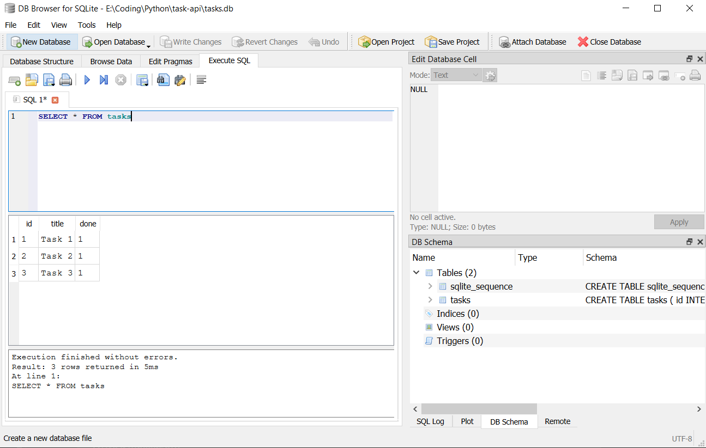

# Task API

A small **CRUD API** for managing a to-do list, built with **FastAPI** and backed by **SQLite**.

Tasks are stored in a real database, so they survive server restarts. The API surface is
unchanged from the in-memory version — same URLs, same request bodies, same responses, same
status codes. Only the storage layer was replaced.

> FlyRank Internship · Backend Development Track
> Week 2 · A1 — build the CRUD API · Week 3 · A1 — connect it to a database

---

## Architecture

```
Client  ──HTTP──▶  FastAPI (main.py)  ──SQL──▶  SQLite (tasks.db)
                        │
                        └── db.py : connection, schema, seeding, row → dict
```

| File | Responsibility |
|---|---|
| `main.py` | The API layer. Routing, validation, status codes. Knows nothing about files or disks. |
| `db.py` | The data layer. Opens connections, creates the schema, seeds first-run data, converts rows to the API's JSON shape. |
| `tasks.db` | The database. Auto-created on first run, **not** committed to Git. |

The separation is the point of the Week 3 assignment: swapping SQLite for PostgreSQL later means
rewriting `db.py` and leaving `main.py` almost untouched.

---

## Why SQLite

- **Zero setup.** No server process, no port, no username, no password, no Docker. The entire
  database is one file, and the driver ships with Python's standard library — there is nothing to
  `pip install`.
- **Self-installing.** The app creates the file and the schema on first run, so a stranger who
  clones this repo can run it immediately with no database step.
- **Real SQL.** It is not a toy. SQLite speaks standard SQL, enforces constraints, and runs
  transactions, so everything learned here transfers directly to PostgreSQL or MySQL.
- **Genuinely everywhere.** It ships inside Android, iOS, Chrome, Firefox and macOS. It is
  probably the most widely deployed database engine in the world.

The trade-off: SQLite is a single file accessed by one process at a time, so it is a poor fit for
a high-traffic service with many concurrent writers. That is the point at which you move to a
client/server database — and the reason the data layer lives in its own module.

---

## Where the database lives

```
E:\Coding\Python\task-api\tasks.db
```

The path is resolved relative to `db.py`, so it always sits next to the source regardless of
where the server is launched from:

```python
DB_PATH = Path(__file__).parent / "tasks.db"
```

`tasks.db` is listed in `.gitignore` and is **deliberately not committed**. The schema lives in
the code; the database is a generated artifact, like `venv/`. Cloning the repo and running the
app rebuilds it from scratch.

### Schema

```sql
CREATE TABLE IF NOT EXISTS tasks (
    id    INTEGER PRIMARY KEY AUTOINCREMENT,
    title TEXT    NOT NULL,
    done  INTEGER NOT NULL DEFAULT 0
);
```

`IF NOT EXISTS` makes startup idempotent — running it a hundred times creates the table once.
Seeding is guarded separately by a `SELECT COUNT(*)`, so the three example tasks are inserted
only when the table is empty, not on every boot.

SQLite has no boolean type, so `done` is stored as `1` / `0`. `db.row_to_task()` converts it back
to a real boolean, which is why the API still returns `"done": false` and not `"done": 0`.

---

## Requirements

- Python 3.10+
- Git

## Install & run

```bash
git clone https://github.com/MTahaR-dev/task-api.git
cd task-api

python -m venv venv
# Windows
venv\Scripts\activate
# macOS / Linux
source venv/bin/activate

pip install -r requirements.txt
fastapi dev main.py
```

That is the whole setup. On first launch the app creates `tasks.db`, builds the `tasks` table and
inserts three example tasks.

- API: **http://localhost:8000**
- Interactive docs (Swagger UI): **http://localhost:8000/docs**

---

## Endpoints

| Method | Path | Description | Success | Errors |
|---|---|---|---|---|
| `GET` | `/` | API name, version and available resources | `200` | — |
| `GET` | `/health` | Liveness check | `200` | — |
| `GET` | `/stats` | Counts of total / done / open, via SQL `COUNT` and `SUM` | `200` | — |
| `GET` | `/tasks` | List all tasks | `200` | — |
| `GET` | `/tasks?done=true` | Filter by completion, via SQL `WHERE` | `200` | — |
| `GET` | `/tasks?search=milk` | Search titles, via SQL `LIKE` | `200` | — |
| `GET` | `/tasks/{id}` | Get one task by id | `200` | `404` unknown id |
| `POST` | `/tasks` | Create a task from `{"title": "..."}` | `201` | `400` missing/empty title |
| `PUT` | `/tasks/{id}` | Update `title` and/or `done` | `200` | `400` empty body · `404` unknown id |
| `DELETE` | `/tasks/{id}` | Delete a task | `204` (empty body) | `404` unknown id |

### Task shape

```json
{ "id": 1, "title": "Buy milk", "done": false }
```

| Field | Type | Notes |
|---|---|---|
| `id` | integer | Assigned by the database via `AUTOINCREMENT`, never by the client |
| `title` | string | Required on create, must not be blank |
| `done` | boolean | Always `false` on create · stored as `1`/`0` in SQLite |

### Error shape

Every error returns a consistent JSON body, produced by a single global exception handler:

```json
{ "error": "Task 99 not found" }
```

---

## Persistence

The behaviour that changed between Week 2 and Week 3:

```bash
# create a task
curl -i -X POST http://localhost:8000/tasks -H "Content-Type: application/json" -d '{"title":"Gym"}'

# stop the server with Ctrl+C, then start it again
fastapi dev main.py

curl -i http://localhost:8000/tasks     # "Gym" is still there
```

Previously `tasks` was a Python list in RAM; when the process ended its memory was released and
the list was rebuilt from its literal definition on the next start. Now every write goes to
`tasks.db` on disk inside a committed transaction, so the process can die without taking the data
with it.

Note that the three example tasks are **not** re-inserted on restart. The seed is guarded by a
row count, so it only fires against an empty table.

---

## Example: full CRUD cycle with curl

> On Windows PowerShell use `curl.exe`, not `curl` — the latter is an alias for `Invoke-WebRequest`.

```
$ curl -i -X POST http://localhost:8000/tasks -H "Content-Type: application/json" -d '{"title":"Buy milk"}'
HTTP/1.1 201 Created
date: Sat, 08 Aug 2026 19:50:03 GMT
server: uvicorn
content-length: 40
content-type: application/json

{"id":4,"title":"Buy milk","done":false}


$ curl -i -X PUT http://localhost:8000/tasks/4 -H "Content-Type: application/json" -d '{"done":true}'
HTTP/1.1 200 OK
date: Sat, 08 Aug 2026 19:50:03 GMT
server: uvicorn
content-length: 39
content-type: application/json

{"id":4,"title":"Buy milk","done":true}


$ curl -i http://localhost:8000/tasks
HTTP/1.1 200 OK
date: Sat, 08 Aug 2026 19:50:03 GMT
server: uvicorn
content-length: 157
content-type: application/json

[{"id":1,"title":"Task 1","done":false},{"id":2,"title":"Task 2","done":true},{"id":3,"title":"Task 3","done":false},{"id":4,"title":"Buy milk","done":true}]


$ curl -i -X DELETE http://localhost:8000/tasks/4
HTTP/1.1 204 No Content
date: Sat, 08 Aug 2026 19:50:03 GMT
server: uvicorn


$ curl -i http://localhost:8000/tasks/99
HTTP/1.1 404 Not Found
date: Sat, 08 Aug 2026 19:50:03 GMT
server: uvicorn
content-length: 29
content-type: application/json

{"error":"Task 99 not found"}


$ curl -i -X POST http://localhost:8000/tasks -H "Content-Type: application/json" -d '{}'
HTTP/1.1 400 Bad Request
date: Sat, 08 Aug 2026 19:50:03 GMT
server: uvicorn
content-length: 29
content-type: application/json

{"error":"Title is required"}


$ curl -i "http://localhost:8000/tasks?done=true"
HTTP/1.1 200 OK
date: Sat, 08 Aug 2026 19:50:03 GMT
server: uvicorn
content-length: 39
content-type: application/json

[{"id":2,"title":"Task 2","done":true}]


$ curl -i http://localhost:8000/stats
HTTP/1.1 200 OK
date: Sat, 08 Aug 2026 19:50:03 GMT
server: uvicorn
content-length: 29
content-type: application/json

{"total":3,"done":1,"open":2}
```

**This output is byte-for-byte identical to the in-memory version's**, which is the entire point
of the assignment: persistence is an implementation detail hidden behind the API.

Note the `204 No Content` response — no `content-length`, no body at all. The status code *is*
the answer.

---

## Swagger UI

Every endpoint is documented and executable at `/docs`. FastAPI generates the OpenAPI spec
directly from the route decorators and type hints — no spec file is written by hand.


---

## Exploring the database directly

Opened `tasks.db` in [DB Browser for SQLite](https://sqlitebrowser.org/) and ran queries by hand
against the same file the API uses.



### Queries executed

```sql
-- every task (what GET /tasks runs)
SELECT * FROM tasks;

-- only completed tasks (what GET /tasks?done=true runs)
SELECT * FROM tasks WHERE done = 1;

-- how many tasks exist (what GET /stats runs)
SELECT COUNT(*) FROM tasks;

-- mark everything complete
UPDATE tasks SET done = 1;

-- remove everything complete
DELETE FROM tasks WHERE done = 1;
```

Running the `UPDATE` and then refreshing `GET /tasks` changes the API's response with no code
change and no restart. The database is the source of truth; the API is one client of it among
many possible others.

> `UPDATE` and `DELETE` without a `WHERE` clause affect **every row**, with no confirmation and no
> undo. The safe habit is to write the statement as a `SELECT` first, confirm it returns exactly
> the rows intended, then swap in the destructive verb.

---

## Notes on design decisions

- **Raw `sqlite3` rather than an ORM.** The assignment asks for CRUD operations expressed as SQL
  queries, and writing them by hand makes the mapping between HTTP verbs and SQL statements
  explicit: `POST`→`INSERT`, `GET`→`SELECT`, `PUT`→`UPDATE`, `DELETE`→`DELETE`.
- **Every value passes through a `?` placeholder.** Interpolating user input into a SQL string
  with an f-string would allow SQL injection. The one f-string in `update_task` builds only
  *column names*, all of which come from this codebase; the *values* still travel as bound
  parameters.
- **Ids come from `AUTOINCREMENT` and `cursor.lastrowid`**, not from `max(id) + 1` in Python.
  Computing ids in application code has a race condition — two simultaneous requests can read the
  same maximum and claim the same id. The database assigns them atomically.
- **`cursor.rowcount` drives the 404s** on `PUT` and `DELETE`. A row count of zero means nothing
  matched, which detects a missing id in a single query rather than a separate `SELECT` first.
- **`title` is declared optional in the Pydantic model**, then validated by hand. Declaring it
  required would make FastAPI return `422 Unprocessable Entity`, but the assignment specifies
  `400 Bad Request`, so validation is explicit in order to control the status code.
- **`PUT` uses `is not None` checks**, not truthiness. `if payload.done:` would ignore `false`,
  making it impossible to un-tick a completed task.
- **A single `@app.exception_handler`** reshapes FastAPI's default `{"detail": ...}` into
  `{"error": ...}` for every endpoint at once, rather than hand-writing error bodies in five places.
- **Query parameters for filtering, path parameters for identity.** `/tasks/3` addresses one
  specific resource; `/tasks?done=true` describes a view of the collection.

---

## Roadmap

- Add `created_at` / `updated_at` timestamps.
- Move from SQLite to PostgreSQL — this should require changes to `db.py` only.
- Bonus Stage 7 (*AI vs me*): specify this same API to an AI assistant, run its output against the
  checkpoints above, and diff it against this hand-built version. Not yet completed.
