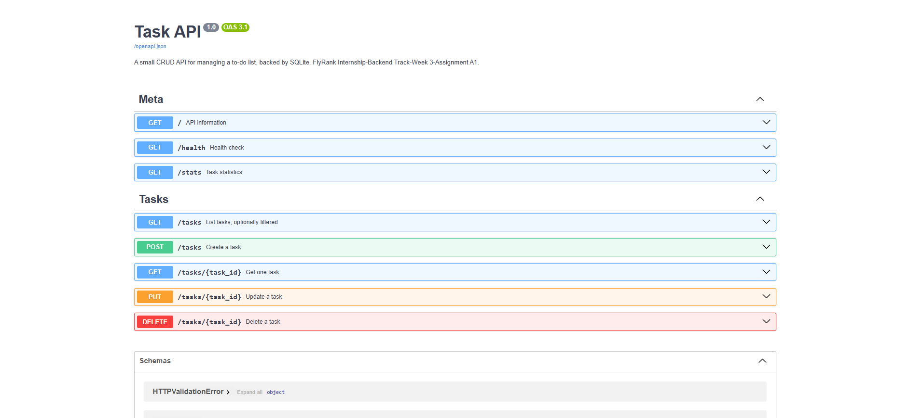

# Task API

A CRUD API for managing a to-do list, built with **FastAPI**, with **pluggable storage** behind a
repository interface. Runs against **PostgreSQL in Docker** by default; a SQLite implementation is
kept alongside it so the two can be swapped by changing one environment variable.

The whole stack — application and database — starts with a single command:

```bash
docker compose up
```

> FlyRank Internship · Backend Development Track
> W2 A1 — build the CRUD API · W3 A1 — connect it to a database · W3 A2 — Postgres in Docker

---

## Architecture

```
                     ┌──────────────────────────┐
  Client ──HTTP──▶   │  main.py                 │   routing · validation · status codes
                     │  (the API layer)         │   imports no database driver
                     └───────────┬──────────────┘
                                 │  TaskRepository  (abstract, 6 methods)
                     ┌───────────┴──────────────┐
                     ▼                          ▼
        SQLiteTaskRepository          PostgresTaskRepository
              tasks.db                  postgres:16 in Docker
                                        └── named volume (data survives the container)
```

| Path | Responsibility |
|---|---|
| `main.py` | HTTP only. Routes, Pydantic models, status codes, error shape. |
| `repositories/base.py` | The storage contract: an abstract class with six methods. |
| `repositories/sqlite_repo.py` | SQLite implementation (`?` placeholders, `INTEGER` booleans). |
| `repositories/postgres_repo.py` | Postgres implementation (`%s` placeholders, native `BOOLEAN`, `RETURNING`). |
| `repositories/__init__.py` | Factory. Reads `TASK_REPOSITORY` from `.env` and returns one implementation or the other. |
| `init.sql` | Postgres schema + seed. Executed once by the database container on first boot. |
| `docker-compose.yml` | The stack: `db` + `app`, a private network, a healthcheck, a volume. |
| `Dockerfile` | How the app is built into an image. |

`main.py` does not import `sqlite3` or `psycopg`, and contains no SQL. It asks a `TaskRepository`
for data and translates the answers into HTTP:

```python
task = repo.get_task(task_id)
if task is None:
    raise HTTPException(status_code=404, detail=f"Task {task_id} not found")
return task
```

The repository reports facts — `None` for "no such row", `False` for "nothing deleted". It never
raises `HTTPException`, because a database has no opinion about HTTP status codes. Keeping that
boundary clean is what makes the implementations interchangeable.

### An honest note on "routes unchanged"

The assignment asks for this claim to be made honestly, so precisely:

- **`main.py` did change once**, when the storage layer was extracted. Route bodies that previously
  opened SQLite connections and ran SQL inline were rewritten to call `repo.*` methods. That was the
  refactor, and it is a real diff.
- **After that refactor, switching SQLite → Postgres required zero changes to `main.py`.** The
  Postgres repository was written as a new file, and the swap was performed by editing one line in
  `.env` (`TASK_REPOSITORY=sqlite` → `postgres`). Routes, request bodies, responses and status codes
  are byte-identical across both backends.

So the layering does pay off as advertised — but the payment was made up front, in the refactor,
not for free.

---

## Quick start

**Requirements:** Docker Desktop. Nothing else — no local Python, no local Postgres.

```bash
git clone https://github.com/MTahaR-dev/task-api.git
cd task-api

copy .env.example .env        # Windows   (cp .env.example .env on macOS/Linux)

docker compose up
```

- API: **http://localhost:8000**
- Interactive docs (Swagger UI): **http://localhost:8000/docs**
- Postgres: **localhost:5432** (`taskuser` / see your `.env`)

On first boot the database container creates the `tasks` table from `init.sql` and inserts three
example rows. Confirm which backend is live at any time:

```bash
curl http://localhost:8000/
# {"name":"Task API","version":"2.0","storage":"postgres","endpoints":["/tasks"]}
```

### Useful commands

| Command | What it does |
|---|---|
| `docker compose up -d` | start in the background |
| `docker compose logs -f app` | follow the app's logs |
| `docker compose ps` | what is running |
| `docker compose down` | stop and delete the containers — **keeps the data** |
| `docker compose down -v` | also delete the volume — **destroys the data** |
| `docker compose exec db psql -U taskuser -d taskdb` | a SQL shell inside the database container |

### Running without Docker

Set `TASK_REPOSITORY=sqlite` in `.env` and run it directly. No database server needed:

```bash
python -m venv venv && venv\Scripts\activate
pip install -r requirements.txt
fastapi dev main.py
```

---

## Configuration

All configuration comes from environment variables, loaded from `.env` via `python-dotenv`.

**`.env` is gitignored.** `.env.example` is committed as the template, so anyone cloning the repo
can see exactly which variables are required without ever receiving a real credential.

| Variable | Purpose |
|---|---|
| `TASK_REPOSITORY` | `sqlite` or `postgres` — chooses the implementation at startup |
| `POSTGRES_USER` / `POSTGRES_PASSWORD` / `POSTGRES_DB` | used by the `db` container to create the database on first boot |
| `DATABASE_URL` | connection string used by the Postgres repository |

One detail worth knowing: `DATABASE_URL` in `.env` points at `localhost`, for running the app on
your own machine against the container. `docker-compose.yml` **overrides** it for the app container
with the host `db` — inside a compose network, every service is reachable by its service name, and
`localhost` would mean the app container itself.

---

## The database

**Image:** `postgres:16-alpine`
**Volume:** `task-api_postgres_data` → `/var/lib/postgresql/data`

The volume is the reason data survives. Containers are disposable — `docker compose down` deletes
them entirely — but a named volume is a separate object with its own lifecycle, and is only removed
when explicitly asked (`down -v`).

### Schema — `init.sql`

```sql
CREATE TABLE IF NOT EXISTS tasks (
    id    SERIAL  PRIMARY KEY,
    title TEXT    NOT NULL,
    done  BOOLEAN NOT NULL DEFAULT FALSE
);
```

Docker runs every `.sql` file in `/docker-entrypoint-initdb.d/` exactly once: on the first start of
a container whose data volume is empty. It does not run on later starts, so it can never overwrite
existing data. The seed insert is additionally guarded with `WHERE NOT EXISTS (SELECT 1 FROM tasks)`
so that even a forced re-run cannot create duplicates.

The app also calls an idempotent `init_schema()` at startup. In compose this is a no-op, since
`init.sql` already did the work; it exists so the app still works when pointed at a manually created
database.

### SQLite vs Postgres — what actually differed

Only dialect, never logic. The two repository classes have identical method signatures and return
identical dictionaries.

| | SQLite | Postgres |
|---|---|---|
| Placeholder | `?` | `%s` |
| Auto id | `INTEGER PRIMARY KEY AUTOINCREMENT` | `SERIAL PRIMARY KEY` |
| Booleans | none — stored as `1`/`0`, converted in Python | native `BOOLEAN` |
| Id of a new row | `cursor.lastrowid` | `INSERT ... RETURNING id, title, done` |
| Case-insensitive search | `LIKE` (already insensitive for ASCII) | `ILIKE` |
| Conditional count | `COALESCE(SUM(done), 0)` | `COUNT(*) FILTER (WHERE done)` |

Postgres having a real boolean type removed the `bool()` conversion the SQLite version needs, and
`RETURNING` collapsed insert-then-select into a single round trip.

---

## Persistence proof

Verified by creating a row, **deleting both containers**, recreating them, and reading the row back.

**1 — create a task**

```
E:\Coding\Python\task-api>curl -i -X POST http://localhost:8000/tasks -H "Content-Type: application/json" -d "{\"title\":\"Survives restart\"}"
HTTP/1.1 201 Created
date: Mon, 10 Aug 2026 23:13:25 GMT
server: uvicorn
content-length: 48
content-type: application/json

{"id":4,"title":"Survives restart","done":false}
```

**2 — destroy the containers**

```
E:\Coding\Python\task-api>docker compose down
[+] down 3/3
 ✔ Container task-api-app   Removed                                     0.4s
 ✔ Container task-api-db    Removed                                     0.3s
 ✔ Network task-api_default Removed                                     0.2s
```

**3 — confirm nothing is running, but the volume remains**

```
E:\Coding\Python\task-api>docker compose ps
NAME      IMAGE     COMMAND   SERVICE   CREATED   STATUS    PORTS

E:\Coding\Python\task-api>docker volume ls
DRIVER    VOLUME NAME
local     task-api_postgres_data
```

**4 — bring the stack back**

```
E:\Coding\Python\task-api>docker compose up -d
[+] up 3/3
 ✔ Network task-api_default Created                                     0.0s
 ✔ Container task-api-db    Healthy                                     6.2s
 ✔ Container task-api-app   Started                                     6.3s
```

**5 — the row is still there**

```
E:\Coding\Python\task-api>curl http://localhost:8000/tasks
[{"id":1,"title":"Task 1","done":false},{"id":2,"title":"Task 2","done":true},{"id":3,"title":"Task 3","done":false},{"id":4,"title":"Survives restart","done":false}]
```

The database container that originally stored `"Survives restart"` no longer exists — it was removed
in step 2 and a brand new one was created in step 4. The data survived because it lives in the
volume, not in the container. Note also that `init.sql` did **not** re-run on the second boot: the
volume was no longer empty, so Postgres skipped it and left the four rows alone.

---

## Endpoints

| Method | Path | Description | Success | Errors |
|---|---|---|---|---|
| `GET` | `/` | API name, version, **active storage backend**, resources | `200` | — |
| `GET` | `/health` | Liveness check | `200` | — |
| `GET` | `/stats` | Counts of total / done / open, computed by SQL | `200` | — |
| `GET` | `/tasks` | List all tasks | `200` | — |
| `GET` | `/tasks?done=true` | Filter by completion (`WHERE`) | `200` | — |
| `GET` | `/tasks?search=milk` | Search titles (`LIKE` / `ILIKE`) | `200` | — |
| `GET` | `/tasks/{id}` | Get one task | `200` | `404` unknown id |
| `POST` | `/tasks` | Create from `{"title": "..."}` | `201` | `400` missing/empty title |
| `PUT` | `/tasks/{id}` | Update `title` and/or `done` | `200` | `400` empty body · `404` unknown id |
| `DELETE` | `/tasks/{id}` | Delete a task | `204` (empty body) | `404` unknown id |

**Task shape**

```json
{ "id": 1, "title": "Buy milk", "done": false }
```

**Error shape** — one global exception handler gives every endpoint the same error body:

```json
{ "error": "Task 99 not found" }
```

---

## Swagger UI



## Exploring the SQLite database directly

From the previous assignment — `tasks.db` opened in DB Browser for SQLite and queried by hand.


```sql
SELECT * FROM tasks;
SELECT * FROM tasks WHERE done = 1;
SELECT COUNT(*) FROM tasks;
UPDATE tasks SET done = 1;
DELETE FROM tasks WHERE done = 1;
```

The equivalent inside the Postgres container:

```bash
docker compose exec db psql -U taskuser -d taskdb
taskdb=# SELECT * FROM tasks;
```

---

## Notes on design decisions

- **Abstract base class rather than a Protocol** for `TaskRepository`. Both express the contract, but
  inheriting from `ABC` makes Python refuse to instantiate an implementation that forgets a method —
  the error arrives at import time rather than as a `404` at 2am.
- **No `HTTPException` in the repository layer.** Repositories return `None` / `False`; `main.py`
  turns those into status codes. Otherwise the data layer would be unusable from a CLI, a worker, or
  a test.
- **Every value passes through a placeholder** (`?` / `%s`). The single f-string in each
  `update_task` assembles only *column names*, all of which originate in this codebase; the values
  always travel as bound parameters. That is the line between dynamic SQL and SQL injection.
- **Ids are assigned by the database**, via `AUTOINCREMENT` / `SERIAL`, not computed in Python.
  `max(id) + 1` has a race condition: two concurrent requests can read the same maximum.
- **`depends_on: condition: service_healthy`** rather than plain `depends_on`. Postgres accepts TCP
  connections a second or two before it can answer queries, so without the healthcheck the app
  starts too early and crashes on its first connection.
- **`--host 0.0.0.0` in the Dockerfile.** Inside a container, `127.0.0.1` means "this container
  only" and the published port would never reach the app.
- **Dependencies are copied and installed before the source code** in the Dockerfile, so editing
  `main.py` reuses the cached dependency layer instead of reinstalling 45 packages.
- **`title` is optional in the Pydantic model**, then validated by hand, because a required field
  would make FastAPI answer `422` where the specification calls for `400`.
- **`PUT` uses `is not None` checks**, not truthiness — `if payload.done:` would ignore `false` and
  make it impossible to un-tick a task.

---

## Roadmap

- Add Redis to the compose file for caching and background jobs (W4).
- Add an index on `title` and compare `EXPLAIN ANALYZE` before and after on a seeded table.
- Add `created_at` / `updated_at` timestamps.
- Bonus Stage 7 (*AI vs me*): specify this API to an AI assistant, run its output against these
  checkpoints, and diff it against the hand-built version. Not yet completed.
